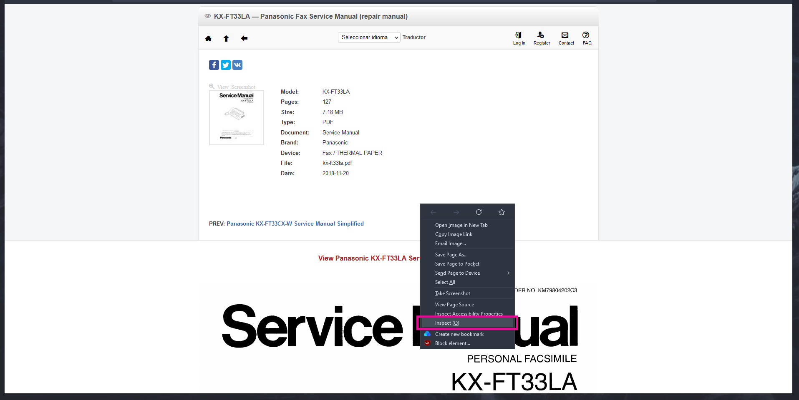
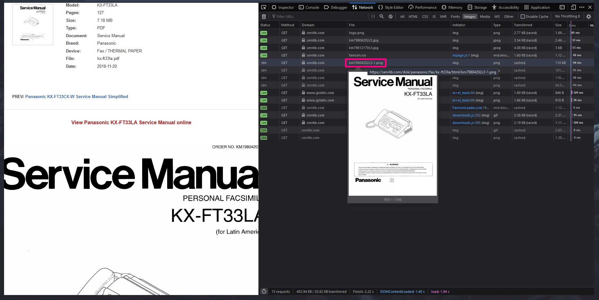
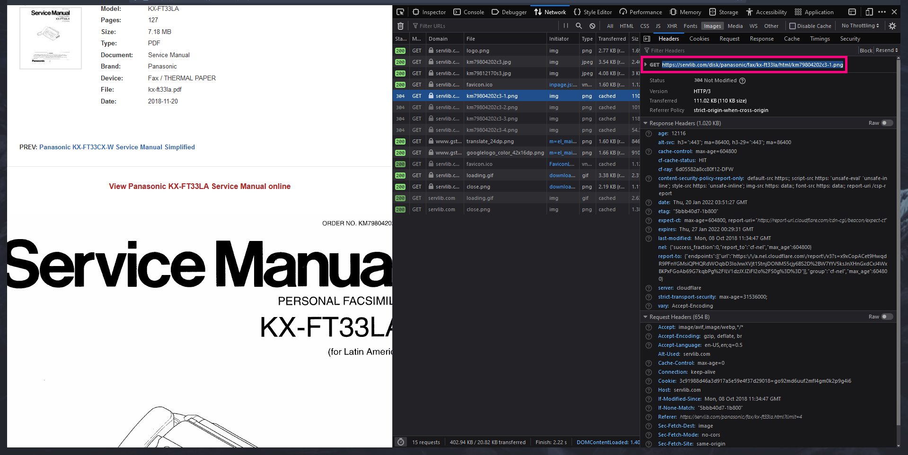

> Download manuals into local and convert them to PDF

Access the manuals from [ServLib](servlib.com).
This for educational purposes on how to find and archive data. The code is quite explained, but you can direct any questions by submitting an issue or messaging me at [@AriZoneVibes](https://twitter.com/AriZoneVibes) :3

Requirements
------------

You will need to have [python](https://docs.microsoft.com/en-us/windows/python/beginners) installed on your computer.

Once installed, run the following commands to install the libraries needed to run the script

**requests** - Used to make HTTP requests. Will ask the website for the image.

```py
pip install requests
```

**pyFPDF** \- Library for PDF document generation. We will use it to take the downloaded images and place them into a pdf

```py
pip install fpdf
```

Obtaining the link
------------------

As an example I'll be using the manual for KX-FT33LA Fax Machine, browsing through Firefox

Access the manual, right-click over the page/image and click "Inspect Element".

<p align="center">
  
</p>

On the developer console, go to the upper menus and press "Network". (It might ask you to reload)  
Browse for the .PNG files on the list that shows up. Hover over it and should show a thumbnail. Confirm it's from the manual you are browsing and click.

<p align="center">
  
</p>

Another view should open. Copy the link after GET and continue, we will now work on the script.

<p align="center">
  
</p>

Script
------

Open `Scrapper.py` file in your favorite text editor. Modify the settings according to the pages you need and if it should make a PDF file from all the pages.

```py
#Settings
Url = "https://servlib.com/disk/panasonic/fax/kx-ft33la/html/km79804202c3-1.png"
#Url you got on the previous step, should look like: https://servlib.com/disk/panasonic/fax/kx-ft33la/html/km79804202c3-1.png

StartPage = 1 #First page to export
EndPage = 127 #Last page to export
MakePdf = True #If will export the final file as PDF
```

The last page value is as indexed on the website, not on the manual itself.

Save the file and open a terminal in the location where you want your files stored. Lastly, run the script. Will display the progress as the images are downloaded.

```powershell
python3 Scrapper.py
```

If you want to learn more about how the script works you can find information on the comments inside the `Scrapper.py` file
